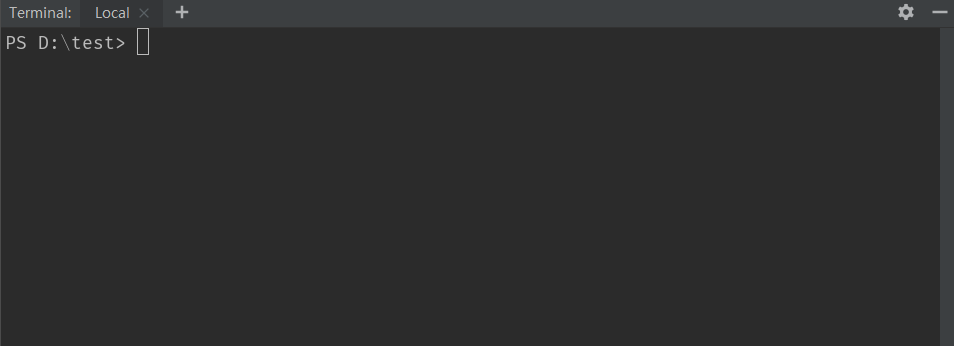

### 项目创建 eslint 配置的脚手架

1. 某项目根目录执行 `eslint-cli` 进入初次向导模式。

1. 某项目根目录执行 `eslint-watch` 进入 webstorm 监控向导模式，适用于其他人已经安装好了 eslint 和 prettier 之后。

向导目前支持的文件格式：`vue, js, scss, md`

目前向导所有类型的文件共用一套映射目录（用户向导中录入的）。
